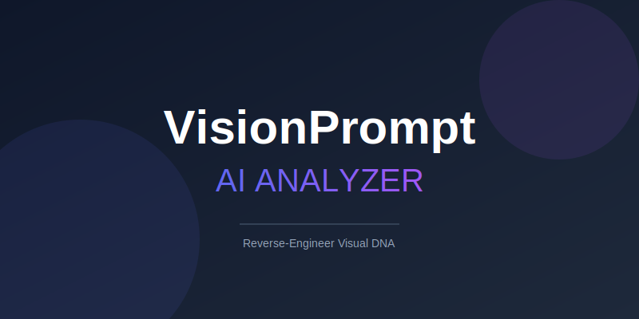
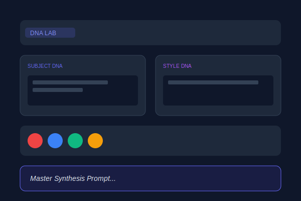
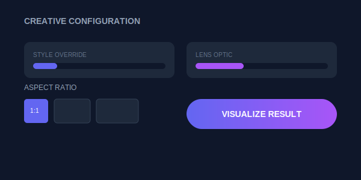
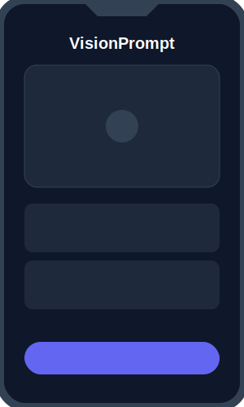

# VisionPrompt Analyzer 🔮

An advanced AI-powered tool that analyzes images to extract subjects, context, and design styles, generating optimized prompts for creative workflows. Powered by Google Gemini 2.5/3.0.



## ✨ Features

*   **🧬 Visual DNA Analysis**: Deconstructs images into Subject, Style, Environment, Typography, and Objects using Gemini Vision models.
*   **🚀 Batch Queue System**: Drag & drop multiple images. The app processes them sequentially without freezing the UI.
*   **📜 Session History**: A visual history bar allows you to switch between analyzed results instantly.
*   **🎨 Creative Configuration**: 
    *   **Style Overrides**: Apply presets like Cinematic, Anime, Cyberpunk, Watercolor.
    *   **Lens Optics**: Simulate 35mm, 85mm, Macro, and Fisheye lenses.
    *   **Auto-Sync**: Modifications to individual components automatically update the Master Synthesis Prompt.
*   **🌍 Multi-language Support**: Full UI and Analysis support for English, Vietnamese, Chinese, Japanese, and Thai.
*   **⚡ Real-time Visualization**: Generate preview images of specific objects or the full prompt directly within the app.

## 📸 Mockups

| Upload & Queue Interface | Analysis DNA Lab |
|:---:|:---:|
|  |  |

| Creative Config | Mobile View |
|:---:|:---:|
|  |  |

## 🛠️ Setup & Installation

1.  **Clone the repository**
    ```bash
    git clone https://github.com/minhit99/Vision-Prompt-Analyzer.git
    cd Vision-Prompt-Analyzer
    ```

2.  **Install Dependencies**
    ```bash
    npm install
    ```

3.  **Configure API Key**
    *   Get your API key from [Google AI Studio](https://aistudio.google.com/).
    *   Create a `.env` file in the root directory:
    ```env
    API_KEY=your_gemini_api_key_here
    ```
    *(Note: The current build uses `process.env.API_KEY` injected via bundler or environment)*.

4.  **Run the Application**
    ```bash
    npm start
    ```

## 🏗️ Tech Stack

*   **Framework**: React 19 + TypeScript
*   **Styling**: Tailwind CSS
*   **AI Model**: Google Gemini (`gemini-3-flash-preview` for analysis, `gemini-2.5-flash-image` for generation)
*   **State Management**: React Hooks (Context API for i18n)

## 📝 Usage Guide

1.  **Upload**: Drag and drop one or more images into the drop zone.
2.  **Analyze**: Click "Analyze Queue". The AI will reverse-engineer the image prompts.
3.  **Edit**: Use the "DNA Lab" to toggle specific elements (Subject, Style, Context) on or off.
4.  **Refine**: Scroll down to "Creative Configuration" to add artistic filters or change aspect ratios.
5.  **Generate**: Click "Visualize Result" to see the AI's interpretation of your optimized prompt.

## 📄 License

MIT License.
